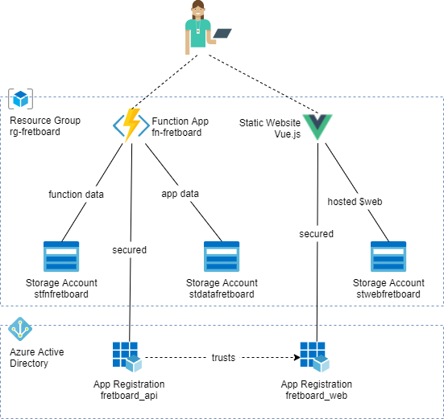

# Fretboard Trainer
A 'what's the note?' guitar fretboard trainer in Vue.js, Typescript & .NET Core Azure Functions.

JAMstack architecture using secured Azure Functions for backend work.

# Architecture

  

### Function App
`fn-fretboard`  
Plan - Consumption Plan  
.NET Core 3.1 (Windows)  

### Storage Accounts
1. Storage account to support the function app - `stfnfretboard` (V1 - cheaper for behind the scences function workings)  
2. Storage account to host static content - `stwebfretboard` (V2)  
3. Storage account for application data and queues - `stdatafretboard` (V2)

### Active Directory
App Registrations  
1. `fretboard_web` The SPA will authenticate against this.  
2. `fretboard_api` Secures the Function App. It trusts `fretboard_web`  

# Blog
The trials and tribulations of building this app.    
[2020-06-18 - Azure Function Core Tools, ClaimsPrincipal and Local Debugging](blog/2020-06-18_claimsprincipal-azure-functions-core-tools.md)

# Documentation

## Deployment
Environment creation and deployment has been automated using PowerShell and ARM Templates  
[View deployment docs](docs/deployment.md)

## Vue.js and Typescript
[Adventures with Vue.js, Vuex, axios, TypeScript](docs/vue.md)

## Authentication
The application is secured via OAuth 2.0 and OpenID Connect and the Azure Functions are secured by bearer token headers.  
[documentation regarding configuration of authentication](/docs/authentication.md)

## Todo/ideas
[Wish list of things I'll probably never get around to doing](/docs/ideas.md)